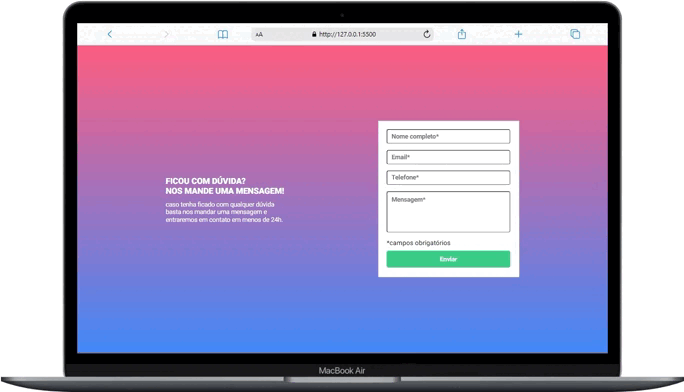
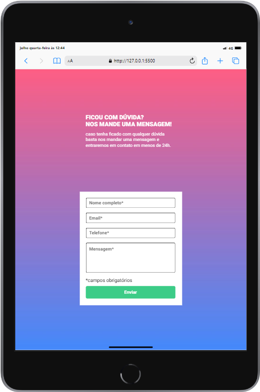

# Formulário com Validação ✅

Esse projeto é uma atividade proposta pelo curso que eu faço DevQuest, essa atividade serviu para colocar em prática tudo que foi ensinado durante o módulo de JavaScript intermediário e também para práticar mais a linguagem JavaScript e também a parte lógica da programação

## Screenshot 
Desktop 💻

Mobile 📱

Tablet 📱

## Tecnologias utilizadas 👨‍💻
- HTML
- CSS
- JAVASCRIPT